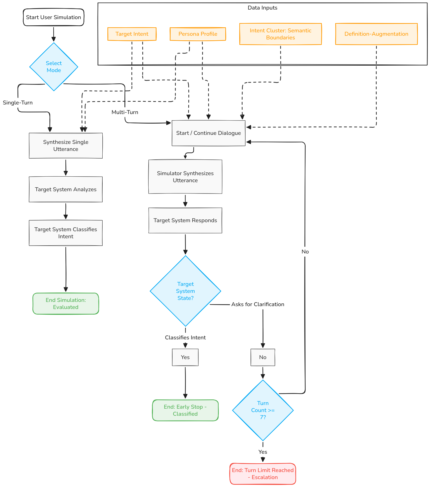
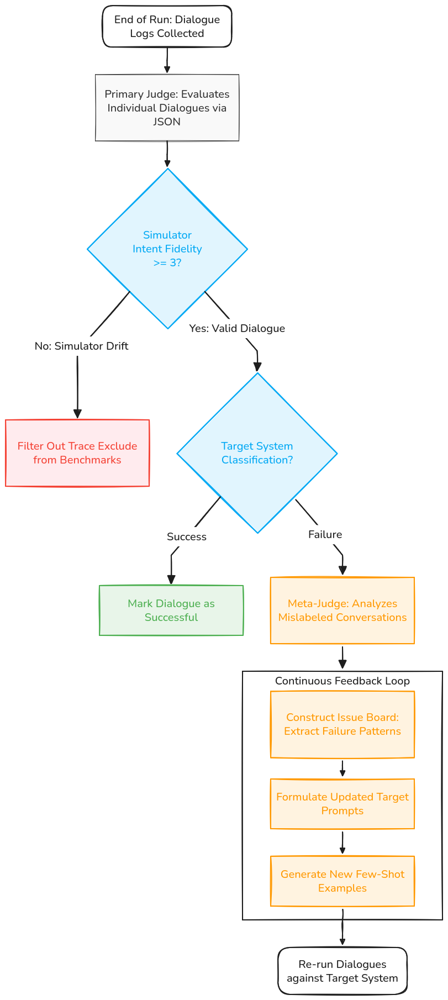

# Automated Testing System for Intent Recognition in Voice Bots

[](https://www.python.org/downloads/)
[](https://github.com/astral-sh/uv)

This repository contains the implementation scripts, evaluation framework, and dataset generation pipelines from the Master's Thesis: **"Conceptual Design of an LLM-Based Testing System for the Automated Evaluation of Intent Recognition in Virtual Assistants for Intelligent Voice Bots"**.

The framework introduces a fully automated, LLM-based simulation engine across single-turn boundaries and complex multi-turn dialogs. It consists of three core components:
1. **User Simulator:** An LLM that simulates a customer with a specific persona.
2. **Target System:** The conversational AI (or LLM intent classifier) being tested.
3. **Judge-LLM:** An independent evaluator that scores the multi-turn dialogues between the simulator and the target system.

## 📂 Repository Architecture

The repository has been structured according to data-science best practices to cleanly separate source code, data, and analytical outputs.

```text
banking77-evaluation/
├── data/                       # 📊 Datasets (Raw, Processed, Synthetic, OOD, Adversarial)
├── figures/                    # 🖼️ Generated visualizations (UMAP, Heatmaps, Boxplots)
├── logs/                       # 🗃️ Raw LLM outputs (Only /published_runs/ are tracked)
│
├── src/                        # 💻 Core Source Code
│   ├── data_prep/              # Dataset generation, STT error injection & OOD synthesis
│   ├── evaluation/             
│   │   ├── single_turn/        # Zero-shot baseline, OOD Rejection & Adversarial testing
│   │   └── multi_turn/         # Simulator Engine, Judge-LLM & Definition-Augmented Prompting
│   ├── analytics/              # Statistical evaluations (p-values) & Plot generators
│   └── profiles/               # Persona JSON configurations
│
├── README.md
├── pyproject.toml              # Python dependencies
└── .env.example                # Template for API credentials
```

---

## Conceptual Design

<p align="center">

</p>

<p align="center">

</p>


## 🚀 Getting Started & Configuration

This project requires API keys to run the User Simulator and the Target Voice Bot (JudgeLLM). **For security reasons, this repository is configured to use environment variables rather than hardcoded credentials.**

### 1. Environment Setup

1. Copy the example environment file:
   ```bash
   cp .env.example .env
   ```
2. Fill in your credentials in the `.env` file:
   ```env
   # Target Bot
   TARGET_BASE_URL=https://api.openai.com/v1
   TARGET_API_KEY=your_target_api_key_here
   TARGET_MODEL_NAME=gpt-5.4-nano

   # User Simulator
   SIMULATOR_BASE_URL=https://api.openai.com/v1
   SIMULATOR_API_KEY=your_simulator_api_key_here
   SIMULATOR_MODEL_NAME=gpt-5.4-nano

   # Judge LLM
   JUDGE_BASE_URL=https://api.openai.com/v1
   JUDGE_API_KEY=your_judge_api_key_here
   JUDGE_MODEL_NAME=gpt-5.4-nano

   # Provider Specific (for Parallel Evaluation)
   OPENAI_API_KEY=your_openai_key
   GEMINI_API_KEY=your_gemini_key
   ```
*(Note: Do not commit your `.env` file! It is already ignored in `.gitignore`.)*

### 2. Install Dependencies

This project uses [uv](https://github.com/astral-sh/uv) for fast and reliable dependency management.

```bash
# Install uv (if you haven't already)
pip install uv

# Create virtual environment and sync dependencies
uv sync --all-groups

# Activate the virtual environment
source .venv/bin/activate
```

---

## 🧪 Running the Evaluations (Reproducing the Thesis)

### 1. Single-Turn Evaluation
Run the baseline benchmarking for zero-shot intent recognition across different LLMs:
```bash
python src/evaluation/single_turn/base_banking77_parallel.py --models all
```

Test the Out-of-Domain (OOD) Rejection capabilities using the Chatterbox persona:
```bash
python src/evaluation/single_turn/eval_ood_single_turn.py --models all
```

### 2. Multi-Turn Simulation 
To run the automated User Simulator against the Target Bot.

**Standard Zero-Shot (ZS) Mode:**
```bash
python src/evaluation/multi_turn/multi-turn-simulator.py --num_dialogues 50
```

**Definition-Augmented (DA) Prompting Mode:**
To prevent *Intent Drift*, you can enable the Definition-Augmented mode via a flag:
```bash
python src/evaluation/multi_turn/multi-turn-simulator.py --use_definitions --num_dialogues 50
```

### 3. Analytics & Statistics
Generate the final metrics, right-to-wrong flip ratios, and accuracy averages across the multi-turn logs:
```bash
python src/analytics/run_statistical_evaluation.py --base_dir logs/published_runs
```

Generate the cross-model persona heatmap:
```bash
python src/evaluation/single_turn/plot_global_persona_heatmap.py
```

---

## 🛠️ Script Configuration & Flags

Almost all scripts in the repository are fully configurable via the command line using `argparse`. Below is a breakdown of the accepted flags and paths.

### 🟢 Fully Configurable Scripts (via `argparse`)

**Data Preparation:**
* **`clean_dataset_labels.py`**: `--input`, `--output`, `--old_label`, `--new_label`
* **`duplicate_and_rewrite.py`**: `--input`, `--output`
* **`generate_ood_single_turn_dataset.py`**: `--profile`, `--num_samples`, `--output_csv`

**Single-Turn Evaluation:**
* **`base_banking77_parallel.py`**: `--models`, `--csv`, `--out-dir` (and `--list`)
* **`eval_ood_single_turn.py`**: `--models`, `--csv`, `--labels-csv`, `--out-dir`

**Multi-Turn Evaluation:**
* **`multi-turn-simulator.py`**: `--csv_path`, `--ood_csv_path`, `--profile`, `--persona`, `--num_dialogues`, `--output_base_dir`, `--concurrency`, `--use_definitions`, `--target_model` and more.
* **`judge_llm.py`**: `--input_dir`, `--output_base_dir`, `--judge_model`, `--concurrency`, `--force`
* **`judge_analyzer.py`**: `--input_dir`, `--output_dir`, `--meta_judge_model`, `--skip_meta_judge`
* **`multi_turn_analyzer.py`**: `--logs_dir`

**Analytics:**
* **`run_statistical_evaluation.py`**: `--base_dir`

### 🔴 Hardcoded Scripts (No `argparse`)
The following dataset generation scripts currently use hardcoded paths inside the code and do not accept CLI arguments:
* **`generate_banking77_dataset.py`**: Reads `banking77_test_clean_labels.csv` and outputs to `banking77_personas_[MODEL].csv`.
* **`generate_intent_definitions.py`**: Reads `banking77_test_labels_clean.csv` and outputs to `intent_definitions.json`.
